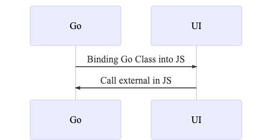

<!--
theme: gaia
class: lead
-->

# Desktop app with Golang

---

# Electron

---

# Application Structure

---

# IPC main

```ts
ipcMain.on("save-auth", async (event, payload) => {
  const service = new Jira();
  const { host, email, password } = payload;
  const { error, session } = await service.signIn(
    `https://${host}`,
    email,
    password
  );
  mainWindow.webContents.send("response-save-auth", { error, session });
  event.returnValue = "OK";
});
```

---

# IPC Renderer

```ts
ipcRenderer.send("save-auth", { host, email, password });

ipcRenderer.on("response-save-auth", (event, payload) => {
  const { error, session } = payload;
  this.setState({ isLoading: false });
  if (error !== undefined) {
    console.log(error);
  } else {
    this.setState({ isLogin: true });
  }
});
```

---

# Pros

- Javascript (Frontend and Backend)
- Support native os features (menu, windows style, notification)
- Standard runtime (chrome)
- It is popular

---

# Cons

- Bloated Applications Size (at least 130mb)
- Unnessary high usage on RAM
- Multiple starter project, tutorial which are not up to date
- [Security](https://github.com/electron/electron/issues/19671) (macOS can ignore)

---

# Golang Desktop App

---

# webview

https://github.com/zserge/webview

> A tiny cross-platform webview library for C/C++/Golang to build modern cross-platform GUIs

---

# Application Structure



---

# Pros

- Light weight
- Low resource usage
- Simular development process with electron

---

# Cons

- Native OS support (menu, notification)
- Bindings for async events
- Need to write your own build script

---

# Demo

https://github.com/darkcl/Notorious

---

# End
